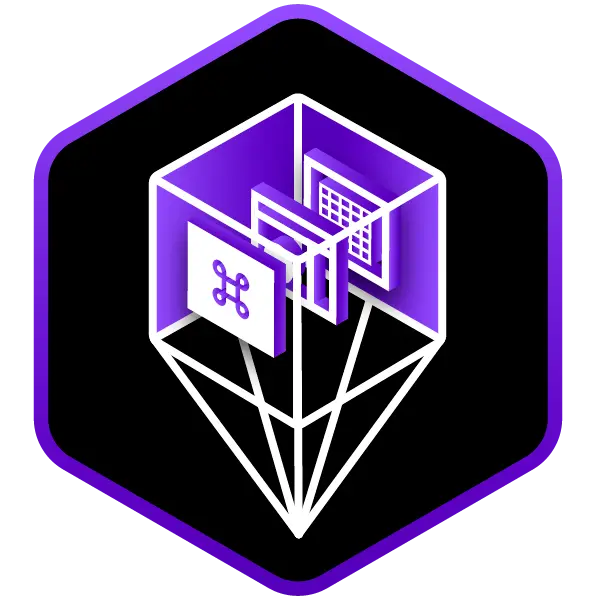

<h1>Unity: Junior Programmer</h1>

## Pathway description
Designed for anyone interested in learning to code or obtaining an entry-level Unity role, this pathway assumes a basic knowledge of Unity and has no math prerequisites. Junior Programmer prepares you to get Unity Certified so that you can demonstrate your job-readiness to employers. 

### Skills covered
- Level 1 Code Comprehension
- Level 1 Debugging
- Level 1 Version Control
- Level 1 Code Optimization
- Level 2 Application Scripting
- Level 2 Programming Theory
---
 

<h2> Programming Basics</h2>

- Unit 1: Player Control
- Introduction to Project Management &amp; Teamwork
- Unit 2: Basic Gameplay
- Challenge: Mod the Cube

<h2> Programming Simple Functionality</h2>

- Unit 3: Sound & Effects
- Unit 4: Gameplay Mechanics
- Unit 5: User Interface
- Introduction to User Feedback &amp; Testing
- Challenge: Counting Prototype
- Challenge: Debug the App

<h2> Manage Scene Flow and Data</h2>

- Scene Flow & Data Persistence
- Challenge: Data Persistence

<h2> Apply Object-Oriented Principles</h2>

- Object-Oriented Programming
- Challenge: Programming Theory